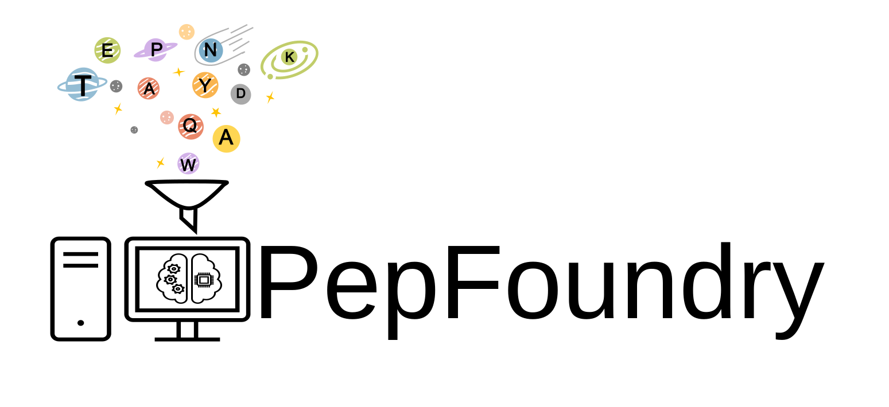
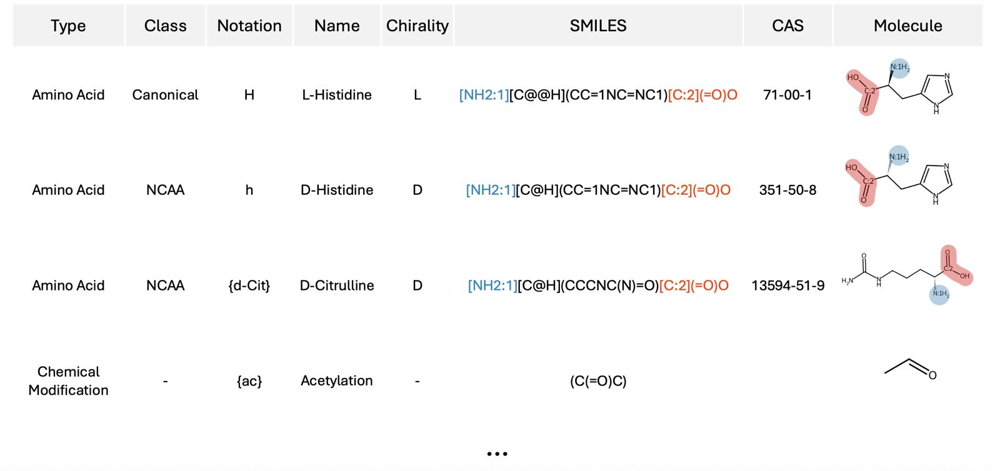

<p align="center">
  
</p>
______________________________________________________________________


PepFoundry is a Python package designed to streamline peptide modeling beyond natural amino acids and linear topologies. It enables the incorporation of synthetic (non-canonical) amino acids and produces both RDKit molecule objects and peptide graphs, facilitating their use in machine learning applications.


In addition, PepFoundry supports the generation of cyclic peptides. These peptides are also represented as RDKit molecule objects and graphs, making them suitable for advanced computational analysis and ML workflows.


## New Updates
-  Jul.08/2026, **Version 2.0.0**: PepFoundry has been modernized to simplify installation and improve compatibility across platforms.

  **Major updates**
  - Migrated the recommended environment to **Python 3.11**.
  - Updated **RDKit** to the latest **2026** release (installed via **conda-forge**).
  - Updated the recommended **PyTorch** version to **2.5.1**.
  - Added automatic detection of the available compute backend during installation
  - Updated core scientific dependencies:
    - NumPy 1.26+
    - pandas 3.x
    - scikit-learn 1.9+

  **Breaking changes**
  - Python versions earlier than **3.11** are no longer supported by the recommended installation.
  - Legacy Python 3.7 / PyTorch 1.x installation workflows have been deprecated.
- Dec.01/2025, **Version 1.1.1**: We have added a new method `get_amino_acids`, this return list of RDKit molecule objects, each representing a single amino acid. See usage examples in [examples_PepFoundry](examples_PepFoundry.ipynb)
- Nov.26/2025, **Version 1.1.0**: We have added a new method `get_smiles_chuckles_format` that automatically converts peptide SMILES into CHUCKLES format, including mapping numbers for the terminal residues. This update introduces a new dependency, `openbabel`. Usage and examples of this method can be found in [examples_CHUCKLES.ipynb](examples_CHUCKLES.ipynb).


## 1. Installation Guide

### 1.1. Creating an Environment with PepFoundry

To automatically create the environment with all required packages, download the file **`setup_pepfoundry.sh`** and run the following command:

```sh
bash setup_pepfoundry.sh 
```

### 1.2. Creating an Anaconda Environment Manually
Alternatively, you can create an Anaconda environment manually by running the following commands manually in the terminal:

#### 1.2.1. Creating the Environment

```sh
conda create --name pepfoundry python=3.11
```

#### 1.2.2. Activating the Environment

```sh
conda activate pepfoundry
```

#### 1.2.3.  Installing Dependencies

```sh
conda install -c conda-forge rdkit numpy=1.26
```
- Install PyTorch (GPU-**{CUDA}**)
```sh
pip install torch --index-url https://download.pytorch.org/whl/{CUDA}
```
*e.g: pip install torch --index-url https://download.pytorch.org/whl/cu121

- Or Install PyTorch (CPU)
```sh
pip install torch --index-url https://download.pytorch.org/whl/cpu
```
- Dependencies:
```sh
pip install openpyxl
```
```sh
pip install scikit-learn
```
```sh
pip install ipykernel
```
```sh
pip install pandas
```
```sh
pip install openbabel-wheel
```
#### 1.2.4.  Installing PepFoundry from GitHub
```sh
pip install git+https://github.com/BilodeauGroup/PepFoundry.git
```

## 2. Usage

Once installed, you can import and use the package in your Python scripts:

```python
from pepfoundry.interface import PepFoundry
```

### 2.1. PepFoundry Class
PepFoundry is the central interface for building peptide `RDKit Mol` objects. It combines the functionalities of peptide construction and amino acid processing through internal modules.

**Before using it, you need to create an instance of the class:**

```python
pepfoundry = PepFoundry()
```

The class use the [default database](pepfoundry/project/core/amino_acids_library.xlsx).

- **Default:**  
  Loads the standard amino acid database included with the package.
[amino_acids_library](pepfoundry/project/core/amino_acids_library.xlsx)

- **Custom Database**  
Optionally, you can provide a custom amino acid database for each class instance by passing the path to an Excel file:
```python
pepfoundry = PepFoundry(custom_dict_path="path/to/custom_amino_acids.xlsx")
```
**Important:** 
The Excel file should adhere to the format and conventions defined in the default database, with amino acids defined in the CHUCKLES format, including Map Numbers. Following this structure ensures that the peptide builder can correctly interpret the amino acids and construct molecules without errors.

### 2.2. Amino Acid Convention


- **Canonical Amino Acids:**  
  - **L-amino acids** are represented with **uppercase letters** (e.g., `A` for **L**-Alanine).  
  - **D-amino acids** are represented with **lowercase letters** (e.g., `a` for **D**-Alanine).  

- **Non-Canonical amino acids** are enclosed in curly braces `{Xyz}`.

- **Modifications** such as acetylation and amidation are also enclosed in `{}`, e.g.:  
  - `{ac}` for acetylation  
  - `{am}` for amidation  


## 3. Examples:

### 3.1. PepFoundry Implementation
Full usage examples are provided in:
- [examples_PepFoundry](examples_PepFoundry.ipynb) 

### 3.2. CHUCKLES Construction
**SMILES construction or rewriting (CHUCKLES format):**  
Examples of how to construct or rewrite SMILES for amino acids in **CHUCKLES format** are provided in:  
- [examples_CHUCKLES.ipynb](examples_CHUCKLES.ipynb)

### 3.3. ML Implementation 
Examples of how PepFoudry can be implemented for ML application is provided in:  
- [ML example](example_ML/example_ML.ipynb)

## 4. Cite
Garzon Otero, D.; Akbari, O.; Mandapati, A.; Bilodeau, C. PepFoundry: A Pipeline for Building Machine-Learning Ready Representations of Nonstandard Peptides Containing Cycles, Non-natural Residues, Polymer Units, and More. J. Chem. Inf. Model. ASAP. https://doi.org/10.1021/acs.jcim.5c02629


